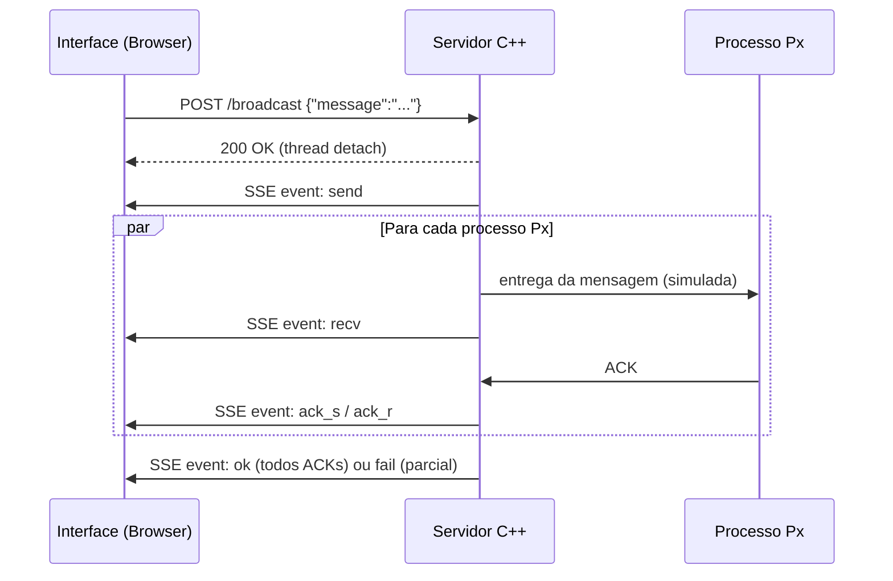

# Algoritmo de Difusão Confiável Baseado em ACK

**Autores:** Bruno Binelli e Bruno Carboni

## Descrição da Proposta

Este trabalho implementa uma simulação didática do algoritmo de **Difusão Confiável Baseada em ACK** (*ACK-based Reliable Broadcast*). O objetivo é demonstrar como um servidor garante que uma mensagem foi entregue a todos os processos clientes de um grupo, mesmo na presença de falhas de rede ou processos temporariamente indisponíveis.

Na aplicação, o servidor inicia uma difusão e aguarda a confirmação explícita (ACK) de cada cliente. Caso um ACK não seja recebido dentro do tempo limite, a mensagem é retransmitida automaticamente até um número máximo de tentativas configurável. Ao final, o algoritmo classifica a entrega como *confiável* (todos os ACKs recebidos) ou *parcial* (ao menos um cliente falhou definitivamente).

A aplicação foi desenvolvida em **C++ (backend)** com servidor HTTP/SSE próprio, e **HTML + CSS + JavaScript (frontend)** para visualização interativa em tempo real do estado dos processos, do anel de ACKs e dos eventos do algoritmo.

O projeto aplica diretamente os seguintes conceitos estudados na disciplina:

- **Cliente-servidor:** a interface web (cliente) se comunica com o processo C++ (servidor) via HTTP e recebe eventos em tempo real por SSE.
- **Sincronização:** o estado compartilhado entre as threads de entrega é protegido por `std::mutex` e `std::condition_variable`, garantindo consistência sem condições de corrida.
- **Exclusão mútua:** o acesso ao `EventBus` e ao estado das mensagens (`stateMtx`) é controlado por locks exclusivos, impedindo leituras e escritas concorrentes inconsistentes.
- **Acordo distribuído:** a entrega só é classificada como *confiável* quando **todos** os processos do grupo confirmam o recebimento via ACK — modelando a semântica de acordo por unanimidade.

---

## Como Executar

### Pré-requisitos

- GCC ≥ 13 ou Clang ≥ 16 (suporte a C++17)
- CMake ≥ 3.15
- Navegador moderno (Chrome, Firefox, Edge)

> **Sem dependências externas.** O servidor HTTP/SSE é implementado diretamente sobre sockets POSIX (`<sys/socket.h>`), utilizando apenas a biblioteca padrão do C++ e chamadas de sistema POSIX. Nenhuma instalação adicional de pacotes é necessária.

### Compilar e rodar o backend

```bash
cmake -S src -B build
cmake --build build
./build/servidor          # porta padrão: 8765
./build/servidor 9000     # porta customizada
```

### Abrir o frontend

Abra o arquivo `interface/index.html` diretamente no navegador. A interface se conecta automaticamente ao backend em `localhost:8765`. O endereço pode ser alterado pelo botão ⚙ na barra superior.

---

## Organização dos Arquivos

### Backend (`src/`)

| Arquivo | Responsabilidade |
|---|---|
| `main.cpp` | Ponto de entrada: inicializa os processos padrão e sobe o servidor |
| `ReliableBroadcast.h` | Declaração dos tipos, `EventBus` e classe `ReliableBroadcast` |
| `ReliableBroadcast.cpp` | Implementação do algoritmo de difusão confiável |
| `HttpServer.h` | Declaração do servidor HTTP/SSE |
| `HttpServer.cpp` | Endpoints REST e streaming de eventos SSE |
| `CMakeLists.txt` | Build do projeto com C++17 e pthreads |

### Frontend (`interface/`)

| Arquivo | Responsabilidade |
|---|---|
| `index.html` | Estrutura HTML da interface |
| `estilo/style.css` | Tema visual completo (dark/light) com variáveis CSS |
| `js/visual.js` | Renderização do canvas (topologia) e animações SVG de pacotes |
| `js/ui.js` | Atualização do DOM: cards de clientes, grid de ACKs, tabela, log |
| `js/backend.js` | Conexão SSE, handlers de eventos e requisições HTTP ao backend |
| `js/app.js` | Estado global compartilhado, tema e bootstrap da aplicação |

---

## Requisitos Funcionais

### Cliente (Processo)

Cada processo cliente deve:

- Possuir um identificador único: `P1`, `P2`, …, `P5`.
- Poder estar em um de três estados de rede: `ONLINE`, `OFFLINE` ou `SLOW`.
- Possuir uma taxa de perda de pacotes configurável (`lossRate`), de `0%` a `100%`.
- Receber a mensagem difundida pelo servidor.
- Enviar um ACK ao servidor após processar a mensagem.
- Ter seu estado de ACK rastreado individualmente por mensagem.

No código, o cliente é definido em `ReliableBroadcast.h`:

```cpp
enum class ClientStatus { ONLINE, OFFLINE, SLOW };

struct ClientConfig {
    int          id;
    std::string  name;
    ClientStatus status   = ClientStatus::ONLINE;
    double       lossRate = 0.0;   // 0.0 – 1.0
};
```

### Servidor (Difusor)

O servidor deve:

- Manter a lista de todos os processos participantes do grupo.
- Disparar a difusão de uma mensagem para todos os clientes em paralelo.
- Aguardar o ACK de cada cliente dentro do tempo limite (`ackTimeout`).
- Retransmitir a mensagem caso o ACK não chegue (até `maxRetries` vezes).
- Registrar o estado final de cada entrega: `confirmed` ou `failed`.
- Emitir eventos em tempo real via SSE para a interface.

Os parâmetros são configuráveis em tempo de execução:

```cpp
int maxRetries = 3;      // máximo de retransmissões por cliente
int ackTimeout = 1500;   // ms de espera pelo ACK
int simDelay   = 300;    // ms de delay base entre etapas da simulação
```

---

## Estado dos ACKs

Cada par (mensagem, cliente) possui um registro de ACK com ciclo de vida bem definido:

```cpp
enum class AckState { PENDING, SENDING, CONFIRMED, FAILED, RETRYING };

struct AckRecord {
    int      clientId = -1;
    AckState state    = AckState::PENDING;
    int      retries  = 0;
};
```

| Estado | Significado |
|---|---|
| `PENDING` | Aguardando início da entrega |
| `SENDING` | Mensagem em trânsito para o cliente |
| `CONFIRMED` | ACK recebido com sucesso |
| `FAILED` | Todas as tentativas esgotadas sem ACK |
| `RETRYING` | Aguardando retransmissão após falha |

---

## Tipo de Requisição

A requisição principal é a **difusão de uma mensagem** para o grupo. Ela é iniciada pela interface via HTTP POST e contém o conteúdo da mensagem:

```http
POST /broadcast
Content-Type: application/json

{ "message": "Olá, processos!" }
```

No backend, esse endpoint dispara a difusão em uma thread separada para não bloquear a resposta HTTP:

```cpp
// HttpServer.cpp
if (req.method == "POST" && req.path == "/broadcast") {
    std::string content = jsonGet(req.body, "message");
    std::thread([content]() { gAlgo.broadcast(content); }).detach();
    ...
}
```

---

## Identificação dos Processos

Os processos são identificados numericamente e exibidos como `P1` a `P5`. O servidor é o nó central que não participa do anel, apenas difunde e coleta ACKs.

Em `main.cpp`, os processos padrão são inicializados assim:

```cpp
const std::vector<ClientConfig> defaultClients = {
    {1, "P1", ClientStatus::ONLINE, 0.0},
    {2, "P2", ClientStatus::ONLINE, 0.0},
    {3, "P3", ClientStatus::ONLINE, 0.0},
    {4, "P4", ClientStatus::ONLINE, 0.0},
    {5, "P5", ClientStatus::ONLINE, 0.0},
};
gAlgo.setClients(defaultClients);
```

---

## Comunicação entre Servidor e Processos

A comunicação é simulada por threads concorrentes dentro do processo C++. Cada entrega para um cliente roda em sua própria thread, modelando o paralelismo de uma rede real. Os eventos são transmitidos ao navegador via **Server-Sent Events (SSE)**.

### Diagrama de Sequência



---

## Funcionamento do Algoritmo

O método central do algoritmo é `broadcast()` em `ReliableBroadcast.cpp`:

```cpp
void ReliableBroadcast::broadcast(const std::string& content) {
    // 1. Registra a mensagem e inicializa ACKs como PENDING
    // 2. Emite evento 'send' via SSE
    // 3. Dispara uma thread por cliente em paralelo
    std::vector<std::thread> threads;
    for (auto& c : snap)
        threads.emplace_back([this, msgId, c]() { deliverToClient(msgId, c); });
    for (auto& t : threads)
        if (t.joinable()) t.join();
    // 4. Consolida resultados e emite 'ok' ou 'fail'
}
```

### Entrega com Retransmissão

Para cada cliente, o método `deliverToClient()` executa o seguinte fluxo:

```cpp
for (int attempt = 0; attempt <= maxRetries; ++attempt) {
    // Verifica estado atual do cliente (pode ter mudado)
    // Simula envio (SENDING)
    // Se OFFLINE ou perda aleatória → emite 'lost', aguarda e retenta
    // Se sucesso → cliente emite ACK, servidor confirma (CONFIRMED)
    // Se esgotou tentativas → marca como FAILED
}
```

### Passagem de Eventos para a Interface

Todos os estados intermediários são publicados no `EventBus` global e transmitidos via SSE:

```cpp
// ReliableBroadcast.cpp
void ReliableBroadcast::emit(const std::string& type, const std::string& json) {
    gBus.push(type, json);
}
```

```cpp
// HttpServer.cpp — loop do stream SSE
while (alive) {
    gBus.cv.wait_for(lk, 500ms, [&]{ return gBus.queue.size() > cursor; });
    for (auto& e : newEvents) {
        std::string pkt = "event: " + e.type + "\ndata: " + e.data + "\n\n";
        if (send(clientFd, pkt.c_str(), pkt.size(), 0) <= 0) alive = false;
    }
}
```

---

## Envio e Recepção de Mensagens

### Início da Difusão

O servidor emite o evento `send` ao iniciar a difusão, informando o ID da mensagem, o conteúdo e o total de destinatários:

```cpp
emit("send",
     "{\"msgId\":"    + std::to_string(msgId) +
     ",\"content\":\"" + escapeJson(content)  +
     ",\"total\":"    + std::to_string(snap.size()) + "}");
```

### Recepção pelo Processo

Quando o processo recebe a mensagem com sucesso, o servidor emite o evento `recv`:

```cpp
emit("recv",
     "{\"msgId\":"       + std::to_string(msgId)     +
     ",\"clientId\":"    + std::to_string(client.id) +
     ",\"clientName\":\"" + escapeJson(client.name)  + "\"}");
```

### Envio e Confirmação do ACK

O ACK percorre dois eventos: `ack_s` (enviado pelo processo) e `ack_r` (recebido pelo servidor):

```cpp
emit("ack_s", "{\"msgId\":" + ... + ",\"clientName\":\"" + ... + "\"}");
std::this_thread::sleep_for(std::chrono::milliseconds(simDelay / 2));
updateAckState(msgId, client.id, AckState::CONFIRMED, attempt);
emit("ack_r", "{\"msgId\":" + ... + ",\"clientName\":\"" + ... + "\"}");
```

### Perda de Pacote e Retransmissão

```cpp
if (offline || dropped) {
    emit("lost", "{...\"reason\":\"" + escapeJson(reason) + "\"...}");

    if (attempt == maxRetries) {
        updateAckState(msgId, client.id, AckState::FAILED, attempt);
        emit("fail", "{...\"msg\":\"Falha definitiva após N tentativas\"}");
        return;
    }
    std::this_thread::sleep_for(std::chrono::milliseconds(ackTimeout / 3));
    continue;   // retenta
}
```

---

## Tratamento de Falhas

A aplicação oferece dois mecanismos de falha configuráveis em tempo real pela interface:

### Processo Offline

Quando um processo está `OFFLINE`, todas as tentativas de entrega são rejeitadas imediatamente, simulando um nó inacessível:

```cpp
bool offline = (curStatus == ClientStatus::OFFLINE);
if (offline) {
    // Emite 'lost' e retenta até maxRetries
}
```

### Perda de Pacotes (Loss Rate)

Quando `lossRate > 0`, cada tentativa de entrega tem uma probabilidade de ser descartada pela rede:

```cpp
static std::uniform_real_distribution<double> dist(0.0, 1.0);
bool dropped = (!offline && dist(rng) < curLoss);
```

### Processo Lento

Processos no estado `SLOW` introduzem um atraso adicional de processamento antes de enviar o ACK, simulando sobrecarga:

```cpp
const int procDelay = (curStatus == ClientStatus::SLOW)
                      ? simDelay * 3 : simDelay / 2;
std::this_thread::sleep_for(std::chrono::milliseconds(procDelay));
```

### Atualização de Estado em Tempo Real

O status de cada processo pode ser alterado durante a simulação via endpoint REST:

```http
POST /client
Content-Type: application/json

{ "id": 2, "status": "offline", "lossRate": 0.0 }
```

---

## Endpoints da API

| Método | Endpoint | Descrição |
|---|---|---|
| `GET` | `/events` | Stream SSE de eventos em tempo real |
| `GET` | `/state` | Estado atual completo em JSON |
| `POST` | `/broadcast` | Inicia uma nova difusão `{"message":"..."}` |
| `POST` | `/config` | Atualiza parâmetros do algoritmo |
| `POST` | `/client` | Atualiza status e loss rate de um processo |

---

## Eventos SSE

| Evento | Emissor | Significado |
|---|---|---|
| `send` | Servidor | Difusão iniciada |
| `recv` | Servidor | Processo recebeu a mensagem |
| `ack_s` | Servidor | Processo enviou o ACK |
| `ack_r` | Servidor | Servidor confirmou o ACK |
| `lost` | Servidor | Pacote perdido (offline ou loss rate) |
| `retry` | Servidor | Início de retransmissão |
| `ok` | Servidor | Entrega confiável: todos os ACKs recebidos |
| `fail` | Servidor | Entrega parcial: ao menos um ACK não chegou |
| `ack_update` | Servidor | Atualização pontual de um ACK individual |
| `state` | Servidor | Estado completo sincronizado |
| `info` | Servidor | Mensagem informativa (ex: mudança de status) |

---

## Observação sobre a Implementação

O projeto simula o comportamento de um sistema distribuído em uma única aplicação C++. Os processos clientes são representados por threads concorrentes e structs de configuração, e a rede é simulada por delays programados e sorteio de perda de pacotes via distribuição uniforme. A comunicação real com o navegador ocorre via HTTP e SSE sobre sockets POSIX, sem dependências externas.

Essa decisão preserva a lógica essencial do algoritmo de difusão confiável — retransmissão com ACK, timeout e contagem de falhas — enquanto facilita a visualização e a demonstração interativa dos estados internos.

---

## Limitações da Implementação

Esta implementação foi desenvolvida com fins didáticos para demonstrar o funcionamento do algoritmo de difusão confiável baseada em ACK.

- A comunicação entre o servidor e os processos clientes é **simulada por threads e delays** dentro de um único processo C++, não utilizando sockets de rede entre máquinas distintas.
- O **timeout de ACK** (`ackTimeout`) não é implementado como um temporizador real por thread; em vez disso, o delay é aproximado por `ackTimeout / 3` por tentativa.
- O **EventBus** mantém todos os eventos em memória sem limite de tamanho, o que pode consumir recursos em simulações muito longas.
- Não há **persistência** de estado: ao encerrar o servidor, todo o histórico de mensagens e configurações é perdido.
- A interface suporta apenas **um servidor backend** por vez.
